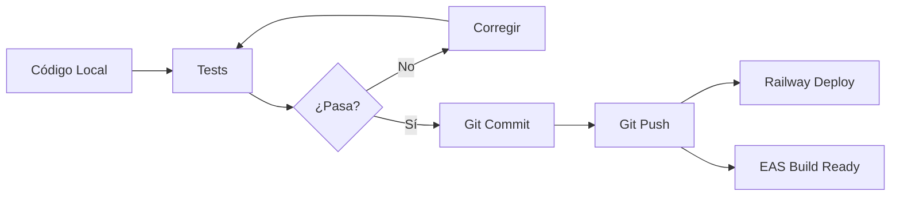

# Directrices Permanentes del Proyecto Nexora

## Fecha de Creación: 2026-02-24

---

## 🎯 Principio Fundamental

**Evitar pérdida de tiempo y vueltas innecesarias manteniendo todo sincronizado y validado.**

---

## 📋 Checklist Obligatorio Antes de Cada Sesión

### 1. Sincronización de Git
```bash
git status                    # Verificar cambios pendientes
git pull origin main          # Traer últimos cambios
git push origin main          # Subir cambios locales
```

### 2. Verificación de Railway
- Verificar que el backend está desplegado correctamente
- Revisar logs en Railway Dashboard si hay errores
- Confirmar que las variables de entorno están configuradas

### 3. Verificación de Expo/EAS
- Confirmar que el proyecto existe en Expo
- Verificar que los assets están en el repositorio
- Ejecutar `npx expo doctor` antes de builds

---

## 🚀 Antes de Generar APK/AAB

### Checklist Pre-Build (OBLIGATORIO)

```bash
# 1. Verificar que los assets están en el repositorio
git ls-tree HEAD nexora-mobile/assets/
# Debe mostrar: adaptive-icon.png, favicon.png, icon.png, splash-icon.png

# 2. Verificar que no hay cambios pendientes
git status
# Debe mostrar: "nothing to commit, working tree clean"

# 3. Ejecutar validación de Expo
cd nexora-mobile && npx expo doctor
# Debe mostrar: "All checks passed"

# 4. Verificar que el código está en GitHub
git push origin main
```

### Si el Checklist Falla

**Assets no están en repositorio:**
```bash
git add -f nexora-mobile/assets/
git commit -m "fix: add app assets"
git push origin main
```

**expo doctor falla:**
- Leer los errores mostrados
- Corregir antes de continuar
- No intentar build hasta que pase todas las validaciones

---

## 📦 Después de Cada Cambio de Código

### Secuencia Obligatoria

1. **Validar código localmente**
   ```bash
   cd backend && npm run test
   cd nexora-mobile && npm run test
   ```

2. **Commit con mensaje descriptivo**
   ```bash
   git add .
   git commit -m "tipo(scope): descripción del cambio"
   ```

3. **Push inmediato a GitHub**
   ```bash
   git push origin main
   ```

4. **Verificar despliegue en Railway**
   - Railway despliega automáticamente al detectar push
   - Esperar 2-3 minutos y verificar logs

---

## 🔧 Tipos de Commit

| Tipo | Descripción | Ejemplo |
|------|-------------|---------|
| `feat` | Nueva funcionalidad | `feat(auth): add password reset` |
| `fix` | Corrección de bug | `fix(assets): add missing icons` |
| `chore` | Tareas de mantenimiento | `chore: update dependencies` |
| `docs` | Documentación | `docs: update README` |
| `refactor` | Refactorización | `refactor(api): simplify auth flow` |
| `test` | Tests | `test(auth): add login tests` |
| `security` | Correcciones de seguridad | `security: remove hardcoded credentials` |

---

## 🚫 Errores Comunes a Evitar

### 1. No hacer push de cambios
**Problema:** El código queda solo localmente, EAS no lo ve.
**Solución:** Siempre `git push` después de cada commit.

### 2. Assets fuera del repositorio
**Problema:** EAS Build falla con "cannot access file".
**Solución:** Verificar con `git ls-tree` antes de build.

### 3. Variables de entorno faltantes
**Problema:** Backend falla en producción.
**Solución:** Mantener lista de variables en `supabase.env.example`.

### 4. Credenciales hardcodeadas
**Problema:** Seguridad comprometida.
**Solución:** Usar siempre variables de entorno.

---

## 📊 Estado de los Servicios

| Servicio | URL | Estado |
|----------|-----|--------|
| Backend API | https://nexora-app-production-3104.up.railway.app | Verificar |
| Frontend Web | https://nexora-app.online | Verificar |
| GitHub | https://github.com/lynx0106/nexora-app | Verificar |
| Expo | https://expo.dev/accounts/lynx0106/projects/nexora-mobile | Verificar |

---

## 🔄 Flujo de Trabajo Recomendado



---

## 📝 Notas Importantes

1. **Nunca trabajar sin sincronizar** - Siempre hacer pull antes de empezar
2. **Commit frecuente** - Pequeños commits son mejores que uno grande
3. **Push inmediato** - No acumular commits locales
4. **Verificar antes de build** - Ejecutar checklist pre-build siempre
5. **Documentar cambios** - Actualizar README y docs cuando sea necesario

---

## 🆘 Contacto y Soporte

Si algo falla:
1. Revisar logs de Railway
2. Revisar logs de EAS Build
3. Consultar este documento
4. Buscar en la documentación de Expo/Railway

---

**Última actualización:** 2026-02-24
**Responsable:** Equipo de Desarrollo Nexora
