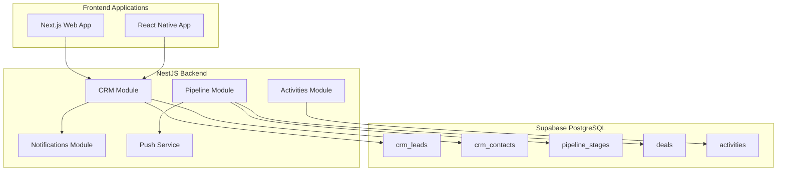
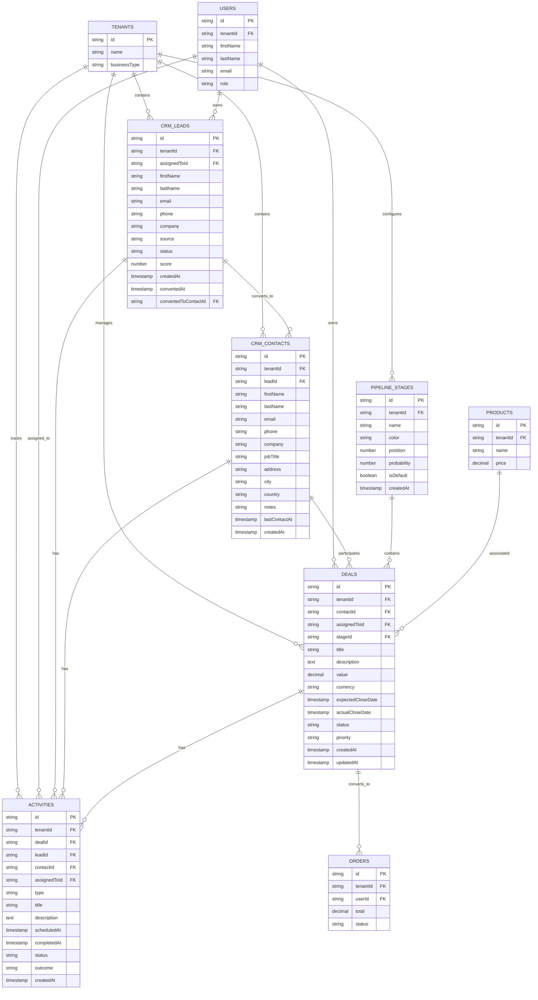

# FASE 3: Diseño de Arquitectura CRM + Pipeline de Ventas

## 📋 Resumen Ejecutivo

Este documento define la arquitectura completa para la implementación del módulo CRM + Pipeline de Ventas en Nexora-App. El diseño es compatible con el sistema multi-tenant existente y se integra con las notificaciones push ya implementadas.

## 🎯 Alcance

### Funcionalidades Principales
1. **Gestión de Leads** - Captura y seguimiento de prospectos
2. **Gestión de Contactos** - Base de datos de clientes potenciales y existentes
3. **Pipeline de Ventas** - Kanban visual con etapas personalizables
4. **Deals/Oportunidades** - Seguimiento de oportunidades de venta
5. **Actividades** - Tareas, llamadas, reuniones y seguimientos
6. **Métricas de Conversión** - Análisis de rendimiento del pipeline

## 🏗️ Diagrama de Arquitectura



## 📊 Diagrama Entidad-Relación



## 🗄️ Esquema de Base de Datos

### 1. Tabla: `crm_leads`

Almacena los prospectos potenciales antes de convertirlos en contactos.

```sql
CREATE TABLE crm_leads (
    id UUID PRIMARY KEY DEFAULT gen_random_uuid(),
    tenant_id UUID NOT NULL REFERENCES tenants(id) ON DELETE CASCADE,
    assigned_to_id UUID REFERENCES users(id) ON DELETE SET NULL,
    
    -- Información de contacto
    first_name VARCHAR(100) NOT NULL,
    last_name VARCHAR(100) NOT NULL,
    email VARCHAR(255),
    phone VARCHAR(50),
    company VARCHAR(200),
    job_title VARCHAR(100),
    
    -- Información de origen
    source VARCHAR(50), -- 'website', 'referral', 'social_media', 'email', 'call', 'other'
    source_details TEXT,
    campaign_id VARCHAR(100),
    
    -- Estado y puntuación
    status VARCHAR(50) DEFAULT 'new', -- 'new', 'contacted', 'qualified', 'unqualified', 'converted'
    score INTEGER DEFAULT 0, -- 0-100
    
    -- Campos personalizables
    custom_fields JSONB DEFAULT '{}',
    tags TEXT[],
    
    -- Conversión
    converted_at TIMESTAMPTZ,
    converted_to_contact_id UUID REFERENCES crm_contacts(id),
    
    -- Metadata
    notes TEXT,
    created_at TIMESTAMPTZ DEFAULT NOW(),
    updated_at TIMESTAMPTZ DEFAULT NOW()
);

-- Índices
CREATE INDEX idx_crm_leads_tenant ON crm_leads(tenant_id);
CREATE INDEX idx_crm_leads_assigned ON crm_leads(assigned_to_id);
CREATE INDEX idx_crm_leads_status ON crm_leads(tenant_id, status);
CREATE INDEX idx_crm_leads_email ON crm_leads(email);
CREATE INDEX idx_crm_leads_score ON crm_leads(tenant_id, score DESC);
CREATE INDEX idx_crm_leads_source ON crm_leads(tenant_id, source);
CREATE INDEX idx_crm_leads_created ON crm_leads(tenant_id, created_at DESC);
```

### 2. Tabla: `crm_contacts`

Base de datos de contactos (clientes potenciales y existentes).

```sql
CREATE TABLE crm_contacts (
    id UUID PRIMARY KEY DEFAULT gen_random_uuid(),
    tenant_id UUID NOT NULL REFERENCES tenants(id) ON DELETE CASCADE,
    lead_id UUID REFERENCES crm_leads(id) ON DELETE SET NULL,
    
    -- Información personal
    first_name VARCHAR(100) NOT NULL,
    last_name VARCHAR(100) NOT NULL,
    email VARCHAR(255),
    phone VARCHAR(50),
    alternate_phone VARCHAR(50),
    
    -- Información laboral
    company VARCHAR(200),
    job_title VARCHAR(100),
    industry VARCHAR(100),
    
    -- Dirección
    address TEXT,
    city VARCHAR(100),
    state VARCHAR(100),
    country VARCHAR(100),
    postal_code VARCHAR(20),
    
    -- Clasificación
    type VARCHAR(50) DEFAULT 'prospect', -- 'prospect', 'customer', 'partner', 'supplier'
    lifecycle_stage VARCHAR(50) DEFAULT 'lead', -- 'lead', 'opportunity', 'customer', 'churned'
    
    -- Campos personalizables
    custom_fields JSONB DEFAULT '{}',
    tags TEXT[],
    
    -- Engagement
    last_contact_at TIMESTAMPTZ,
    total_deals_value DECIMAL(12,2) DEFAULT 0,
    total_orders_count INTEGER DEFAULT 0,
    
    -- Metadata
    notes TEXT,
    created_at TIMESTAMPTZ DEFAULT NOW(),
    updated_at TIMESTAMPTZ DEFAULT NOW()
);

-- Índices
CREATE INDEX idx_crm_contacts_tenant ON crm_contacts(tenant_id);
CREATE INDEX idx_crm_contacts_type ON crm_contacts(tenant_id, type);
CREATE INDEX idx_crm_contacts_email ON crm_contacts(email);
CREATE INDEX idx_crm_contacts_lifecycle ON crm_contacts(tenant_id, lifecycle_stage);
CREATE INDEX idx_crm_contacts_tags ON crm_contacts USING GIN(tags);
CREATE INDEX idx_crm_contacts_custom ON crm_contacts USING GIN(custom_fields);
```

### 3. Tabla: `pipeline_stages`

Define las etapas del pipeline de ventas por tenant.

```sql
CREATE TABLE pipeline_stages (
    id UUID PRIMARY KEY DEFAULT gen_random_uuid(),
    tenant_id UUID NOT NULL REFERENCES tenants(id) ON DELETE CASCADE,
    
    -- Configuración visual
    name VARCHAR(100) NOT NULL,
    description TEXT,
    color VARCHAR(7) DEFAULT '#3B82F6', -- Hex color
    icon VARCHAR(50),
    
    -- Ordenamiento
    position INTEGER NOT NULL DEFAULT 0,
    
    -- Métricas
    probability INTEGER DEFAULT 0, -- 0-100, probabilidad de cierre en esta etapa
    
    -- Configuración
    is_default BOOLEAN DEFAULT FALSE,
    is_closed_won BOOLEAN DEFAULT FALSE,
    is_closed_lost BOOLEAN DEFAULT FALSE,
    
    -- Límites
    max_deals INTEGER, -- Límite de deals en esta etapa (opcional)
    
    created_at TIMESTAMPTZ DEFAULT NOW(),
    updated_at TIMESTAMPTZ DEFAULT NOW()
);

-- Índices
CREATE INDEX idx_pipeline_stages_tenant ON pipeline_stages(tenant_id);
CREATE INDEX idx_pipeline_stages_position ON pipeline_stages(tenant_id, position);

-- Datos por defecto
INSERT INTO pipeline_stages (tenant_id, name, color, position, probability, is_default) VALUES
('default', 'Nuevo Lead', '#6B7280', 0, 10, TRUE),
('default', 'Contactado', '#3B82F6', 1, 25, FALSE),
('default', 'Calificado', '#8B5CF6', 2, 40, FALSE),
('default', 'Propuesta', '#F59E0B', 3, 60, FALSE),
('default', 'Negociación', '#EC4899', 4, 80, FALSE),
('default', 'Cerrado Ganado', '#10B981', 5, 100, FALSE),
('default', 'Cerrado Perdido', '#EF4444', 6, 0, FALSE);
```

### 4. Tabla: `deals`

Oportunidades de venta en el pipeline.

```sql
CREATE TABLE deals (
    id UUID PRIMARY KEY DEFAULT gen_random_uuid(),
    tenant_id UUID NOT NULL REFERENCES tenants(id) ON DELETE CASCADE,
    
    -- Relaciones
    contact_id UUID NOT NULL REFERENCES crm_contacts(id) ON DELETE CASCADE,
    assigned_to_id UUID REFERENCES users(id) ON DELETE SET NULL,
    stage_id UUID NOT NULL REFERENCES pipeline_stages(id) ON DELETE RESTRICT,
    
    -- Información del deal
    title VARCHAR(200) NOT NULL,
    description TEXT,
    
    -- Valor
    value DECIMAL(12,2) NOT NULL DEFAULT 0,
    currency VARCHAR(3) DEFAULT 'USD',
    
    -- Fechas
    expected_close_date DATE,
    actual_close_date TIMESTAMPTZ,
    
    -- Estado
    status VARCHAR(50) DEFAULT 'open', -- 'open', 'won', 'lost', 'paused'
    priority VARCHAR(20) DEFAULT 'medium', -- 'low', 'medium', 'high', 'urgent'
    
    -- Productos asociados
    products JSONB DEFAULT '[]', -- [{productId, quantity, price, discount}]
    
    -- Competencia
    competitor VARCHAR(200),
    loss_reason VARCHAR(100), -- 'price', 'features', 'competitor', 'timing', 'other'
    
    -- Campos personalizables
    custom_fields JSONB DEFAULT '{}',
    tags TEXT[],
    
    -- Metadata
    created_at TIMESTAMPTZ DEFAULT NOW(),
    updated_at TIMESTAMPTZ DEFAULT NOW(),
    created_by UUID REFERENCES users(id),
    
    -- Restricción: solo un deal abierto por contacto (opcional)
    CONSTRAINT unique_open_deal_per_contact 
        UNIQUE NULLS NOT DISTINCT (tenant_id, contact_id, status)
        WHERE status = 'open'
);

-- Índices
CREATE INDEX idx_deals_tenant ON deals(tenant_id);
CREATE INDEX idx_deals_contact ON deals(contact_id);
CREATE INDEX idx_deals_assigned ON deals(assigned_to_id);
CREATE INDEX idx_deals_stage ON deals(tenant_id, stage_id);
CREATE INDEX idx_deals_status ON deals(tenant_id, status);
CREATE INDEX idx_deals_priority ON deals(tenant_id, priority);
CREATE INDEX idx_deals_close_date ON deals(tenant_id, expected_close_date);
CREATE INDEX idx_deals_value ON deals(tenant_id, value DESC);
CREATE INDEX idx_deals_tags ON deals USING GIN(tags);
```

### 5. Tabla: `activities`

Actividades de seguimiento (llamadas, reuniones, tareas, emails).

```sql
CREATE TABLE activities (
    id UUID PRIMARY KEY DEFAULT gen_random_uuid(),
    tenant_id UUID NOT NULL REFERENCES tenants(id) ON DELETE CASCADE,
    
    -- Relaciones (al menos una debe estar presente)
    deal_id UUID REFERENCES deals(id) ON DELETE CASCADE,
    lead_id UUID REFERENCES crm_leads(id) ON DELETE CASCADE,
    contact_id UUID REFERENCES crm_contacts(id) ON DELETE CASCADE,
    
    -- Asignación
    assigned_to_id UUID REFERENCES users(id) ON DELETE SET NULL,
    created_by UUID REFERENCES users(id),
    
    -- Tipo de actividad
    type VARCHAR(50) NOT NULL, -- 'call', 'meeting', 'email', 'task', 'note', 'sms', 'whatsapp'
    
    -- Detalles
    title VARCHAR(200) NOT NULL,
    description TEXT,
    
    -- Programación
    scheduled_at TIMESTAMPTZ NOT NULL,
    duration_minutes INTEGER, -- Duración estimada
    timezone VARCHAR(50) DEFAULT 'America/Bogota',
    
    -- Ubicación (para reuniones)
    location VARCHAR(255),
    is_online BOOLEAN DEFAULT FALSE,
    meeting_link VARCHAR(500),
    
    -- Estado
    status VARCHAR(50) DEFAULT 'pending', -- 'pending', 'in_progress', 'completed', 'cancelled', 'overdue'
    
    -- Resultado
    completed_at TIMESTAMPTZ,
    outcome VARCHAR(50), -- 'successful', 'no_answer', 'voicemail', 'not_interested', 'follow_up', 'other'
    outcome_notes TEXT,
    
    -- Recordatorios
    reminder_sent BOOLEAN DEFAULT FALSE,
    reminder_sent_at TIMESTAMPTZ,
    
    -- Campos personalizables
    custom_fields JSONB DEFAULT '{}',
    
    created_at TIMESTAMPTZ DEFAULT NOW(),
    updated_at TIMESTAMPTZ DEFAULT NOW()
);

-- Índices
CREATE INDEX idx_activities_tenant ON activities(tenant_id);
CREATE INDEX idx_activities_deal ON activities(deal_id);
CREATE INDEX idx_activities_lead ON activities(lead_id);
CREATE INDEX idx_activities_contact ON activities(contact_id);
CREATE INDEX idx_activities_assigned ON activities(assigned_to_id);
CREATE INDEX idx_activities_type ON activities(tenant_id, type);
CREATE INDEX idx_activities_status ON activities(tenant_id, status);
CREATE INDEX idx_activities_scheduled ON activities(tenant_id, scheduled_at);
CREATE INDEX idx_activities_overdue ON activities(tenant_id, status, scheduled_at) 
    WHERE status IN ('pending', 'in_progress') AND scheduled_at < NOW();
```

## 🔐 Políticas RLS (Row Level Security)

```sql
-- ============================================
-- RLS POLICIES FOR CRM MODULE
-- ============================================

-- 1. CRM_LEADS
ALTER TABLE crm_leads ENABLE ROW LEVEL SECURITY;

CREATE POLICY "Users can view leads from their tenant"
ON crm_leads FOR SELECT
USING (tenant_id IN (
    SELECT tenant_id FROM users WHERE id = auth.uid()::text
));

CREATE POLICY "Users can create leads for their tenant"
ON crm_leads FOR INSERT
WITH CHECK (tenant_id IN (
    SELECT tenant_id FROM users WHERE id = auth.uid()::text
));

CREATE POLICY "Users can update leads from their tenant"
ON crm_leads FOR UPDATE
USING (tenant_id IN (
    SELECT tenant_id FROM users WHERE id = auth.uid()::text
));

CREATE POLICY "Admins can delete leads from their tenant"
ON crm_leads FOR DELETE
USING (tenant_id IN (
    SELECT tenant_id FROM users 
    WHERE id = auth.uid()::text 
    AND role IN ('admin', 'owner', 'superadmin')
));

-- 2. CRM_CONTACTS
ALTER TABLE crm_contacts ENABLE ROW LEVEL SECURITY;

CREATE POLICY "Users can view contacts from their tenant"
ON crm_contacts FOR SELECT
USING (tenant_id IN (
    SELECT tenant_id FROM users WHERE id = auth.uid()::text
));

CREATE POLICY "Users can create contacts for their tenant"
ON crm_contacts FOR INSERT
WITH CHECK (tenant_id IN (
    SELECT tenant_id FROM users WHERE id = auth.uid()::text
));

CREATE POLICY "Users can update contacts from their tenant"
ON crm_contacts FOR UPDATE
USING (tenant_id IN (
    SELECT tenant_id FROM users WHERE id = auth.uid()::text
));

CREATE POLICY "Admins can delete contacts from their tenant"
ON crm_contacts FOR DELETE
USING (tenant_id IN (
    SELECT tenant_id FROM users 
    WHERE id = auth.uid()::text 
    AND role IN ('admin', 'owner', 'superadmin')
));

-- 3. PIPELINE_STAGES
ALTER TABLE pipeline_stages ENABLE ROW LEVEL SECURITY;

CREATE POLICY "Users can view pipeline stages from their tenant"
ON pipeline_stages FOR SELECT
USING (tenant_id IN (
    SELECT tenant_id FROM users WHERE id = auth.uid()::text
));

CREATE POLICY "Admins can manage pipeline stages"
ON pipeline_stages FOR ALL
USING (tenant_id IN (
    SELECT tenant_id FROM users 
    WHERE id = auth.uid()::text 
    AND role IN ('admin', 'owner', 'superadmin')
));

-- 4. DEALS
ALTER TABLE deals ENABLE ROW LEVEL SECURITY;

CREATE POLICY "Users can view deals from their tenant"
ON deals FOR SELECT
USING (tenant_id IN (
    SELECT tenant_id FROM users WHERE id = auth.uid()::text
));

CREATE POLICY "Users can create deals for their tenant"
ON deals FOR INSERT
WITH CHECK (tenant_id IN (
    SELECT tenant_id FROM users WHERE id = auth.uid()::text
));

CREATE POLICY "Users can update deals from their tenant"
ON deals FOR UPDATE
USING (tenant_id IN (
    SELECT tenant_id FROM users WHERE id = auth.uid()::text
));

CREATE POLICY "Admins can delete deals from their tenant"
ON deals FOR DELETE
USING (tenant_id IN (
    SELECT tenant_id FROM users 
    WHERE id = auth.uid()::text 
    AND role IN ('admin', 'owner', 'superadmin')
));

-- 5. ACTIVITIES
ALTER TABLE activities ENABLE ROW LEVEL SECURITY;

CREATE POLICY "Users can view activities from their tenant"
ON activities FOR SELECT
USING (tenant_id IN (
    SELECT tenant_id FROM users WHERE id = auth.uid()::text
));

CREATE POLICY "Users can create activities for their tenant"
ON activities FOR INSERT
WITH CHECK (tenant_id IN (
    SELECT tenant_id FROM users WHERE id = auth.uid()::text
));

CREATE POLICY "Users can update their assigned activities"
ON activities FOR UPDATE
USING (
    tenant_id IN (SELECT tenant_id FROM users WHERE id = auth.uid()::text)
    AND (
        assigned_to_id = auth.uid()::text
        OR created_by = auth.uid()::text
        OR EXISTS (
            SELECT 1 FROM users 
            WHERE id = auth.uid()::text 
            AND role IN ('admin', 'owner', 'superadmin')
        )
    )
);

CREATE POLICY "Admins can delete activities from their tenant"
ON activities FOR DELETE
USING (tenant_id IN (
    SELECT tenant_id FROM users 
    WHERE id = auth.uid()::text 
    AND role IN ('admin', 'owner', 'superadmin')
));
```

## 📁 Estructura de Carpetas

```
backend/src/
├── crm/
│   ├── crm.module.ts
│   ├── crm.controller.ts
│   ├── crm.service.ts
│   ├── dto/
│   │   ├── create-lead.dto.ts
│   │   ├── update-lead.dto.ts
│   │   ├── create-contact.dto.ts
│   │   ├── update-contact.dto.ts
│   │   ├── convert-lead.dto.ts
│   │   └── filters/
│   │       ├── lead-filters.dto.ts
│   │       └── contact-filters.dto.ts
│   └── entities/
│       ├── lead.entity.ts
│       └── contact.entity.ts
│
├── pipeline/
│   ├── pipeline.module.ts
│   ├── pipeline.controller.ts
│   ├── pipeline.service.ts
│   ├── dto/
│   │   ├── create-stage.dto.ts
│   │   ├── update-stage.dto.ts
│   │   ├── reorder-stages.dto.ts
│   │   ├── create-deal.dto.ts
│   │   ├── update-deal.dto.ts
│   │   ├── move-deal.dto.ts
│   │   └── filters/
│   │       └── deal-filters.dto.ts
│   └── entities/
│       ├── stage.entity.ts
│       └── deal.entity.ts
│
├── activities/
│   ├── activities.module.ts
│   ├── activities.controller.ts
│   ├── activities.service.ts
│   ├── activities.scheduler.ts
│   ├── dto/
│   │   ├── create-activity.dto.ts
│   │   ├── update-activity.dto.ts
│   │   ├── complete-activity.dto.ts
│   │   └── filters/
│   │       └── activity-filters.dto.ts
│   └── entities/
│       └── activity.entity.ts
│
└── dashboard/
    └── dashboard.crm.service.ts  # Métricas CRM
```

## 🔌 Endpoints REST API

### CRM - Leads

| Método | Endpoint | Descripción |
|--------|----------|-------------|
| GET | `/api/crm/leads` | Listar leads con filtros y paginación |
| POST | `/api/crm/leads` | Crear nuevo lead |
| GET | `/api/crm/leads/:id` | Obtener detalle de lead |
| PATCH | `/api/crm/leads/:id` | Actualizar lead |
| DELETE | `/api/crm/leads/:id` | Eliminar lead |
| POST | `/api/crm/leads/:id/convert` | Convertir lead a contacto |
| POST | `/api/crm/leads/:id/assign` | Asignar lead a usuario |
| POST | `/api/crm/leads/:id/score` | Actualizar score del lead |

### CRM - Contacts

| Método | Endpoint | Descripción |
|--------|----------|-------------|
| GET | `/api/crm/contacts` | Listar contactos |
| POST | `/api/crm/contacts` | Crear contacto |
| GET | `/api/crm/contacts/:id` | Obtener contacto con historial |
| PATCH | `/api/crm/contacts/:id` | Actualizar contacto |
| DELETE | `/api/crm/contacts/:id` | Eliminar contacto |
| GET | `/api/crm/contacts/:id/deals` | Obtener deals del contacto |
| GET | `/api/crm/contacts/:id/activities` | Obtener actividades del contacto |

### Pipeline - Stages

| Método | Endpoint | Descripción |
|--------|----------|-------------|
| GET | `/api/pipeline/stages` | Listar etapas del pipeline |
| POST | `/api/pipeline/stages` | Crear nueva etapa |
| PATCH | `/api/pipeline/stages/:id` | Actualizar etapa |
| DELETE | `/api/pipeline/stages/:id` | Eliminar etapa |
| POST | `/api/pipeline/stages/reorder` | Reordenar etapas |

### Pipeline - Deals

| Método | Endpoint | Descripción |
|--------|----------|-------------|
| GET | `/api/pipeline/deals` | Listar deals con filtros |
| POST | `/api/pipeline/deals` | Crear nuevo deal |
| GET | `/api/pipeline/deals/:id` | Obtener detalle de deal |
| PATCH | `/api/pipeline/deals/:id` | Actualizar deal |
| DELETE | `/api/pipeline/deals/:id` | Eliminar deal |
| POST | `/api/pipeline/deals/:id/move` | Mover deal a otra etapa |
| POST | `/api/pipeline/deals/:id/assign` | Asignar deal a vendedor |
| POST | `/api/pipeline/deals/:id/close` | Cerrar deal (ganado/perdido) |
| GET | `/api/pipeline/deals/kanban` | Obtener deals agrupados por etapa |

### Activities

| Método | Endpoint | Descripción |
|--------|----------|-------------|
| GET | `/api/activities` | Listar actividades |
| POST | `/api/activities` | Crear actividad |
| GET | `/api/activities/:id` | Obtener actividad |
| PATCH | `/api/activities/:id` | Actualizar actividad |
| DELETE | `/api/activities/:id` | Eliminar actividad |
| POST | `/api/activities/:id/complete` | Completar actividad |
| POST | `/api/activities/:id/cancel` | Cancelar actividad |
| GET | `/api/activities/calendar` | Obtener actividades para calendario |
| GET | `/api/activities/upcoming` | Obtener actividades próximas |
| GET | `/api/activities/overdue` | Obtener actividades vencidas |

### Dashboard CRM

| Método | Endpoint | Descripción |
|--------|----------|-------------|
| GET | `/api/dashboard/crm/metrics` | Métricas generales del CRM |
| GET | `/api/dashboard/crm/pipeline` | Métricas del pipeline |
| GET | `/api/dashboard/crm/conversion` | Tasas de conversión |
| GET | `/api/dashboard/crm/forecast` | Forecast de ventas |
| GET | `/api/dashboard/crm/performance` | Rendimiento por vendedor |

## 📊 Modelos de Datos (TypeORM)

### Lead Entity
```typescript
@Entity('crm_leads')
@Index(['tenantId'])
@Index(['tenantId', 'status'])
@Index(['assignedToId'])
export class Lead {
  @PrimaryGeneratedColumn('uuid')
  id: string;

  @Column()
  tenantId: string;

  @Column({ type: 'uuid', nullable: true })
  assignedToId: string;

  @Column()
  firstName: string;

  @Column()
  lastName: string;

  @Column({ nullable: true })
  email: string;

  @Column({ nullable: true })
  phone: string;

  @Column({ nullable: true })
  company: string;

  @Column({ nullable: true })
  source: string;

  @Column({ default: 'new' })
  status: string;

  @Column({ type: 'int', default: 0 })
  score: number;

  @Column({ type: 'jsonb', default: {} })
  customFields: Record<string, any>;

  @Column('text', { array: true, default: [] })
  tags: string[];

  @Column({ type: 'timestamptz', nullable: true })
  convertedAt: Date;

  @Column({ type: 'uuid', nullable: true })
  convertedToContactId: string;

  @CreateDateColumn()
  createdAt: Date;

  @UpdateDateColumn()
  updatedAt: Date;
}
```

### Contact Entity
```typescript
@Entity('crm_contacts')
@Index(['tenantId'])
@Index(['email'])
export class Contact {
  @PrimaryGeneratedColumn('uuid')
  id: string;

  @Column()
  tenantId: string;

  @Column({ type: 'uuid', nullable: true })
  leadId: string;

  @Column()
  firstName: string;

  @Column()
  lastName: string;

  @Column({ nullable: true })
  email: string;

  @Column({ nullable: true })
  phone: string;

  @Column({ nullable: true })
  company: string;

  @Column({ default: 'prospect' })
  type: string;

  @Column({ default: 'lead' })
  lifecycleStage: string;

  @Column({ type: 'timestamptz', nullable: true })
  lastContactAt: Date;

  @OneToMany(() => Deal, deal => deal.contact)
  deals: Deal[];

  @CreateDateColumn()
  createdAt: Date;
}
```

### PipelineStage Entity
```typescript
@Entity('pipeline_stages')
@Index(['tenantId'])
@Index(['tenantId', 'position'])
export class PipelineStage {
  @PrimaryGeneratedColumn('uuid')
  id: string;

  @Column()
  tenantId: string;

  @Column()
  name: string;

  @Column({ default: '#3B82F6' })
  color: string;

  @Column({ type: 'int', default: 0 })
  position: number;

  @Column({ type: 'int', default: 0 })
  probability: number;

  @Column({ default: false })
  isClosedWon: boolean;

  @Column({ default: false })
  isClosedLost: boolean;

  @OneToMany(() => Deal, deal => deal.stage)
  deals: Deal[];

  @CreateDateColumn()
  createdAt: Date;
}
```

### Deal Entity
```typescript
@Entity('deals')
@Index(['tenantId'])
@Index(['tenantId', 'stageId'])
@Index(['contactId'])
@Index(['assignedToId'])
export class Deal {
  @PrimaryGeneratedColumn('uuid')
  id: string;

  @Column()
  tenantId: string;

  @Column()
  contactId: string;

  @ManyToOne(() => Contact, contact => contact.deals)
  @JoinColumn({ name: 'contactId' })
  contact: Contact;

  @Column({ type: 'uuid', nullable: true })
  assignedToId: string;

  @Column()
  stageId: string;

  @ManyToOne(() => PipelineStage, stage => stage.deals)
  @JoinColumn({ name: 'stageId' })
  stage: PipelineStage;

  @Column()
  title: string;

  @Column({ type: 'decimal', precision: 12, scale: 2, default: 0 })
  value: number;

  @Column({ type: 'date', nullable: true })
  expectedCloseDate: Date;

  @Column({ default: 'open' })
  status: string;

  @Column({ default: 'medium' })
  priority: string;

  @CreateDateColumn()
  createdAt: Date;

  @UpdateDateColumn()
  updatedAt: Date;
}
```

### Activity Entity
```typescript
@Entity('activities')
@Index(['tenantId'])
@Index(['tenantId', 'scheduledAt'])
@Index(['assignedToId'])
@Index(['dealId'])
export class Activity {
  @PrimaryGeneratedColumn('uuid')
  id: string;

  @Column()
  tenantId: string;

  @Column({ type: 'uuid', nullable: true })
  dealId: string;

  @Column({ type: 'uuid', nullable: true })
  leadId: string;

  @Column({ type: 'uuid', nullable: true })
  contactId: string;

  @Column({ type: 'uuid', nullable: true })
  assignedToId: string;

  @Column()
  type: string;

  @Column()
  title: string;

  @Column({ type: 'timestamptz' })
  scheduledAt: Date;

  @Column({ default: 'pending' })
  status: string;

  @Column({ type: 'timestamptz', nullable: true })
  completedAt: Date;

  @CreateDateColumn()
  createdAt: Date;
}
```

## 🔔 Integración con Notificaciones Push

### Eventos que Disparan Notificaciones

```typescript
// En PushService - Métodos adicionales para CRM

/**
 * Notificar cuando se asigna un nuevo lead
 */
async notifyLeadAssigned(userId: string, leadName: string, leadScore: number): Promise<void> {
  await this.sendToUser(
    userId,
    'Nuevo Lead Asignado',
    `${leadName} - Score: ${leadScore}/100`,
    { type: 'crm_lead_assigned' },
  );
}

/**
 * Notificar cuando un deal cambia de etapa
 */
async notifyDealStageChange(
  userId: string, 
  dealTitle: string, 
  stageName: string,
  probability: number
): Promise<void> {
  await this.sendToUser(
    userId,
    'Deal Actualizado',
    `${dealTitle} → ${stageName} (${probability}%)`,
    { type: 'crm_deal_stage_change' },
  );
}

/**
 * Notificar actividad próxima
 */
async notifyUpcomingActivity(
  userId: string,
  activityTitle: string,
  minutesUntil: number
): Promise<void> {
  await this.sendToUser(
    userId,
    'Actividad Próxima',
    `${activityTitle} en ${minutesUntil} minutos`,
    { type: 'crm_activity_reminder' },
  );
}

/**
 * Notificar actividad vencida
 */
async notifyOverdueActivity(
  userId: string,
  activityTitle: string,
  hoursOverdue: number
): Promise<void> {
  await this.sendToUser(
    userId,
    'Actividad Vencida',
    `${activityTitle} - Vencida hace ${hoursOverdue}h`,
    { type: 'crm_activity_overdue' },
  );
}

/**
 * Notificar deal cerrado ganado
 */
async notifyDealWon(
  tenantId: string,
  dealTitle: string,
  value: number,
  closerName: string
): Promise<void> {
  await this.sendToTenantAdmins(
    tenantId,
    '¡Deal Ganado! 🎉',
    `${dealTitle} - $${value.toFixed(2)} por ${closerName}`,
    { type: 'crm_deal_won' },
  );
}
```

### Scheduler para Recordatorios

```typescript
@Injectable()
export class ActivitiesScheduler {
  constructor(
    private activitiesService: ActivitiesService,
    private pushService: PushService,
  ) {}

  // Ejecutar cada 15 minutos
  @Cron('*/15 * * * *')
  async sendActivityReminders() {
    const upcomingActivities = await this.activitiesService.findUpcoming(
      30, // Próximos 30 minutos
    );

    for (const activity of upcomingActivities) {
      if (!activity.reminderSent && activity.assignedToId) {
        await this.pushService.notifyUpcomingActivity(
          activity.assignedToId,
          activity.title,
          30,
        );
        await this.activitiesService.markReminderSent(activity.id);
      }
    }
  }

  // Ejecutar cada hora
  @Cron('0 * * * *')
  async notifyOverdueActivities() {
    const overdueActivities = await this.activitiesService.findOverdue();

    for (const activity of overdueActivities) {
      if (activity.assignedToId) {
        const hoursOverdue = Math.floor(
          (Date.now() - activity.scheduledAt.getTime()) / (1000 * 60 * 60)
        );
        
        await this.pushService.notifyOverdueActivity(
          activity.assignedToId,
          activity.title,
          hoursOverdue,
        );
      }
    }
  }
}
```

## 📈 Métricas y Dashboard

### Métricas Principales

```typescript
interface CRMDashboardMetrics {
  // Leads
  totalLeads: number;
  newLeadsThisMonth: number;
  leadsConverted: number;
  conversionRate: number; // %
  averageLeadScore: number;
  
  // Pipeline
  totalDeals: number;
  totalPipelineValue: number;
  weightedPipelineValue: number; // Valor ponderado por probabilidad
  averageDealSize: number;
  averageSalesCycle: number; // Días promedio
  
  // Rendimiento
  dealsWonThisMonth: number;
  dealsLostThisMonth: number;
  winRate: number; // %
  revenueThisMonth: number;
  
  // Actividades
  activitiesCompleted: number;
  activitiesPending: number;
  activitiesOverdue: number;
  
  // Por etapa
  stageMetrics: {
    stageId: string;
    stageName: string;
    dealCount: number;
    totalValue: number;
    avgDaysInStage: number;
  }[];
}
```

### Queries para Dashboard

```sql
-- Métricas de conversión por etapa
SELECT 
    ps.name as stage_name,
    COUNT(d.id) as deal_count,
    SUM(d.value) as total_value,
    AVG(d.value) as avg_value,
    ps.probability
FROM pipeline_stages ps
LEFT JOIN deals d ON d.stage_id = ps.id AND d.status = 'open'
WHERE ps.tenant_id = :tenantId
GROUP BY ps.id, ps.name, ps.position, ps.probability
ORDER BY ps.position;

-- Forecast de ventas
SELECT 
    DATE_TRUNC('month', d.expected_close_date) as month,
    COUNT(*) as deal_count,
    SUM(d.value * ps.probability / 100) as weighted_value,
    SUM(d.value) as total_value
FROM deals d
JOIN pipeline_stages ps ON ps.id = d.stage_id
WHERE d.tenant_id = :tenantId
    AND d.status = 'open'
    AND d.expected_close_date BETWEEN :startDate AND :endDate
GROUP BY DATE_TRUNC('month', d.expected_close_date)
ORDER BY month;

-- Rendimiento por vendedor
SELECT 
    u.first_name || ' ' || u.last_name as seller_name,
    COUNT(d.id) FILTER (WHERE d.status = 'won' AND d.actual_close_date >= DATE_TRUNC('month', NOW())) as deals_won,
    SUM(d.value) FILTER (WHERE d.status = 'won' AND d.actual_close_date >= DATE_TRUNC('month', NOW())) as revenue,
    COUNT(d.id) FILTER (WHERE d.status = 'open') as open_deals,
    AVG(d.value) FILTER (WHERE d.status = 'won') as avg_deal_size
FROM users u
LEFT JOIN deals d ON d.assigned_to_id = u.id
WHERE u.tenant_id = :tenantId
    AND u.role IN ('admin', 'owner', 'sales')
GROUP BY u.id, u.first_name, u.last_name;
```

## 🔒 Consideraciones de Seguridad

### Permisos por Rol

| Funcionalidad | Superadmin | Admin | Vendedor | Usuario |
|--------------|------------|-------|----------|---------|
| Ver todos los leads | ✅ | ✅ | ✅ (solo asignados) | ❌ |
| Crear leads | ✅ | ✅ | ✅ | ❌ |
| Editar cualquier lead | ✅ | ✅ | ✅ (solo asignados) | ❌ |
| Eliminar leads | ✅ | ✅ | ❌ | ❌ |
| Configurar pipeline | ✅ | ✅ | ❌ | ❌ |
| Ver métricas de todos | ✅ | ✅ | ❌ (solo propias) | ❌ |
| Asignar leads a otros | ✅ | ✅ | ❌ | ❌ |
| Exportar datos CRM | ✅ | ✅ | ❌ | ❌ |

### Validaciones Importantes

1. **Validar tenantId**: Todas las operaciones deben incluir validación de tenant
2. **Validar asignación**: Solo admins pueden asignar a cualquier usuario; vendedores solo pueden auto-asignarse
3. **Validar etapas finales**: Solo usuarios con permisos pueden mover deals a "Cerrado Ganado/Perdido"
4. **Prevenir duplicados**: Validar email/phone únicos por tenant en leads y contacts

## 📅 Estimación de Implementación

### Fase 3A: Core CRM (Semanas 1-2)
- [ ] Crear entidades Lead y Contact
- [ ] Implementar CRUD completo
- [ ] Conversión de Lead a Contact
- [ ] Tests unitarios
- **Estimación**: 40 horas

### Fase 3B: Pipeline de Ventas (Semanas 3-4)
- [ ] Crear entidades Stage y Deal
- [ ] Implementar Kanban API
- [ ] Movimiento de deals entre etapas
- [ ] Configuración de pipeline por tenant
- [ ] Tests unitarios
- **Estimación**: 50 horas

### Fase 3C: Actividades (Semana 5)
- [ ] Crear entidad Activity
- [ ] Sistema de recordatorios
- [ ] Integración con calendario
- [ ] Tests unitarios
- **Estimación**: 30 horas

### Fase 3D: Dashboard y Métricas (Semana 6)
- [ ] Endpoints de métricas
- [ ] Queries de agregación
- [ ] Forecast de ventas
- [ ] Tests de integración
- **Estimación**: 25 horas

### Fase 3E: Integraciones (Semana 7)
- [ ] Notificaciones push
- [ ] Integración con sistema de órdenes existente
- [ ] Webhooks para eventos CRM
- [ ] Tests E2E
- **Estimación**: 25 horas

### Fase 3F: Frontend Web (Semanas 8-10)
- [ ] Vista Kanban de pipeline
- [ ] Gestión de leads y contactos
- [ ] Calendario de actividades
- [ ] Dashboard CRM
- **Estimación**: 60 horas

### Fase 3G: App Móvil (Semanas 11-12)
- [ ] Vista móvil del pipeline
- [ ] Gestión de leads/contacts
- [ ] Notificaciones push
- [ ] Vista rápida de actividades
- **Estimación**: 40 horas

### **Total Estimado: 270 horas (~7 semanas de desarrollo full-time)**

## 🚀 Plan de Despliegue

1. **Migración de Base de Datos**
   - Ejecutar scripts SQL en orden
   - Verificar políticas RLS
   - Crear datos de pipeline por defecto para tenants existentes

2. **Despliegue Backend**
   - Desplegar nuevos módulos
   - Verificar integraciones con servicios existentes
   - Monitorear logs

3. **Despliegue Frontend**
   - Feature flags para habilitar CRM gradualmente
   - Capacitación de usuarios

4. **Monitoreo Post-Despliegue**
   - Métricas de uso
   - Errores y excepciones
   - Rendimiento de queries

## 📋 Checklist de Implementación

- [ ] Crear migraciones SQL
- [ ] Implementar entidades TypeORM
- [ ] Crear DTOs y validaciones
- [ ] Implementar servicios
- [ ] Crear controladores
- [ ] Configurar módulos NestJS
- [ ] Implementar políticas RLS
- [ ] Crear tests unitarios
- [ ] Implementar notificaciones push
- [ ] Crear scheduler de recordatorios
- [ ] Implementar endpoints de dashboard
- [ ] Documentar API
- [ ] Crear frontend web
- [ ] Actualizar app móvil
- [ ] Pruebas E2E
- [ ] Despliegue a producción

---

**Documento creado**: 19 de febrero de 2026  
**Versión**: 1.0  
**Autor**: Architect Mode - Kilo Code  
**Estado**: Listo para revisión