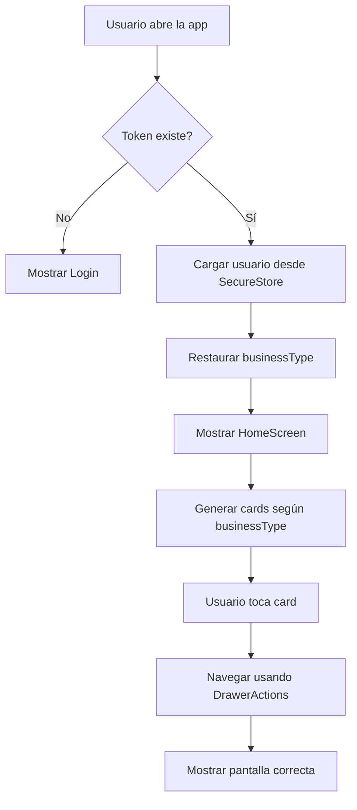

# Plan de Corrección: Cards por Tipo de Negocio

## Fecha: 2026-02-23

## Problemas Identificados

### 1. El `businessType` no se restaura desde el almacenamiento local

**Archivo:** [`nexora-mobile/src/context/AuthContext.tsx`](nexora-mobile/src/context/AuthContext.tsx)

**Problema:** Cuando el usuario ya está logueado y recarga la app, el `businessType` no se restaura desde `SecureStore`. Solo se establece durante el login/registro.

**Código problemático (líneas 44-58):**
```typescript
const loadStoredUser = async () => {
  try {
    const token = await apiClient.getToken();
    if (token) {
      const userJson = await SecureStore.getItemAsync(USER_STORAGE_KEY);
      if (userJson) {
        const storedUser = JSON.parse(userJson);
        setUser(storedUser);  // ❌ No restaura businessType
      }
    }
  } catch (error) {
    console.error('Error loading stored user:', error);
  } finally {
    setIsLoading(false);
  }
};
```

**Solución:** Extraer `businessType` del usuario almacenado y establecerlo en el estado.

---

### 2. Navegación de cards no funciona correctamente

**Archivo:** [`nexora-mobile/src/screens/HomeScreen.tsx`](nexora-mobile/src/screens/HomeScreen.tsx)

**Problema:** Las cards navegan a `'Main'` en lugar de a la pantalla específica dentro del drawer.

**Código problemático (líneas 177-198):**
```typescript
switch (item.route) {
  case 'Products':
    navigation.navigate('Main');  // ❌ Solo abre el drawer, no va a Productos
    break;
  case 'Orders':
    navigation.navigate('Main');  // ❌ Solo abre el drawer, no va a Pedidos
    break;
  // ...
}
```

**Solución:** Usar `DrawerActions` o navegar directamente a las pantallas del RootStack.

---

### 3. Inconsistencia entre nombres de rutas del Drawer y las cards

**Problema:** 
- El Drawer usa nombres en español: `Inicio`, `Productos`, `Pedidos`, `Citas`
- Las cards intentan navegar a: `Products`, `Orders`, `Appointments`

**Solución:** Unificar los nombres de rutas o crear un mapeo correcto.

---

## Arquitectura de Navegación Actual

```
RootStack
├── Auth (Stack Navigator)
│   ├── Login
│   ├── Register
│   └── ForgotPassword
└── Main (Drawer Navigator)
    ├── Inicio (HomeScreen)
    ├── Productos (ProductsScreen)
    ├── Pedidos (OrdersScreen) - condicional
    ├── Citas (AppointmentsScreen) - condicional
    ├── Dashboard (DashboardScreen) - condicional
    └── Perfil (ProfileScreen)

RootStack (pantallas adicionales fuera del drawer)
├── ProductDetail
├── OrderDetail
├── Favorites
├── Cart
├── Checkout
├── ChatList
├── ChatRoom
├── Appointments
├── BookAppointment
└── Dashboard
```

---

## Solución Propuesta

### Paso 1: Corregir AuthContext para restaurar businessType

```typescript
// En loadStoredUser:
const storedUser = JSON.parse(userJson);
setUser(storedUser);
// Agregar:
if (storedUser.businessType) {
  setBusinessType(storedUser.businessType);
}
```

### Paso 2: Corregir navegación en HomeScreen

Usar el hook `useDrawerStatus` y `DrawerActions` para navegar correctamente:

```typescript
import { DrawerActions, useNavigation } from '@react-navigation/native';

// En el handler de las cards:
switch (item.route) {
  case 'Products':
    // Opción A: Navegar dentro del drawer
    navigation.dispatch(DrawerActions.jumpTo('Productos'));
    break;
  case 'Orders':
    navigation.dispatch(DrawerActions.jumpTo('Pedidos'));
    break;
  case 'Appointments':
    navigation.dispatch(DrawerActions.jumpTo('Citas'));
    break;
  // ...
}
```

### Paso 3: Actualizar menuConfig para usar nombres de drawer

```typescript
// En menuConfig.ts, actualizar las rutas:
{
  icon: '🍽️',
  title: features.productLabel,
  subtitle: 'Ver catálogo',
  route: 'Productos',  // Cambiar de 'Products' a 'Productos'
}
```

---

## Archivos a Modificar

| Archivo | Cambio |
|---------|--------|
| `nexora-mobile/src/context/AuthContext.tsx` | Restaurar `businessType` en `loadStoredUser` |
| `nexora-mobile/src/screens/HomeScreen.tsx` | Corregir navegación de cards usando `DrawerActions` |
| `nexora-mobile/src/config/menuConfig.ts` | Actualizar rutas para coincidir con nombres del drawer |

---

## Diagrama de Flujo



---

## Configuración de Cards por Tipo de Negocio

| Tipo | Pedidos | Citas/Reservas | Label Citas |
|------|---------|----------------|-------------|
| restaurant | ✅ | ✅ | Reservas |
| hotel | ❌ | ✅ | Reservas |
| clinic | ❌ | ✅ | Citas |
| salon | ❌ | ✅ | Citas |
| gym | ❌ | ✅ | Citas |
| retail | ✅ | ❌ | - |
| services | ❌ | ✅ | Citas |
| other | ❌ | ❌ | - |

---

## Pruebas a Realizar

1. **Login con usuario de restaurante** → Verificar que muestre "Reservas" y "Pedidos"
2. **Login con usuario de clínica** → Verificar que NO muestre "Pedidos" y muestre "Citas"
3. **Login con usuario de retail** → Verificar que muestre "Pedidos" y NO muestre "Citas"
4. **Recargar app** → Verificar que las cards sigan correctas después de recargar
5. **Navegación de cards** → Verificar que cada card navegue a la pantalla correcta

---

## Estado: PENDIENTE DE IMPLEMENTACIÓN

Este plan requiere cambiar al modo **Code** para implementar las correcciones.
