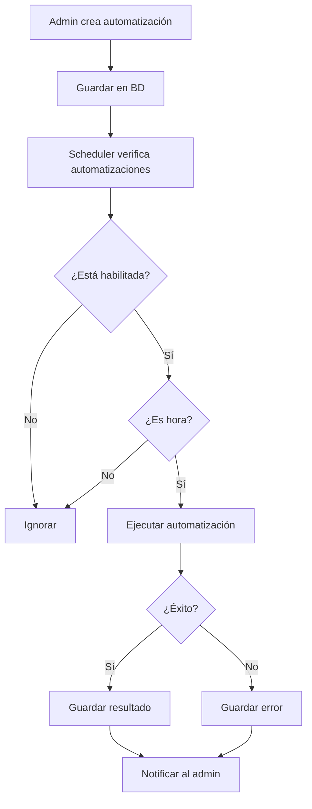

# Sistema de Automatizaciones Configurables

## Visión General

Permitir que el superadmin y admins configuren automatizaciones del sistema desde una interfaz gráfica sin necesidad de código.

## Funcionalidades Principales

### 1. Tipos de Automatizaciones

| Tipo | Descripción | Ejemplo |
|------|-------------|---------|
| **Recordatorios de Citas** | Enviar recordatorios automáticos | "24h antes" |
| **Mensajes Masivos** | Enviar mensajes a todos los clientes | Promociones, noticias |
| **Mensajes Individuales** | Enviar mensajes a clientes específicos | Seguimiento personalizado |
| **Limpieza** | Tareas de mantenimiento | Eliminar tokens expirados |

### 2. Estructura de Datos

```sql
-- Tabla de automatizaciones
CREATE TABLE automations (
  id UUID PRIMARY KEY DEFAULT gen_random_uuid(),
  tenant_id UUID REFERENCES tenants(id),
  name VARCHAR(255) NOT NULL,
  type VARCHAR(50) NOT NULL, -- 'reminder', 'bulk_message', 'cleanup'
  enabled BOOLEAN DEFAULT true,
  schedule VARCHAR(100), -- cron expression: '0 8 * * *'
  config JSONB, -- configuración específica
  created_by UUID REFERENCES users(id),
  created_at TIMESTAMP DEFAULT NOW(),
  updated_at TIMESTAMP DEFAULT NOW()
);

-- Tabla de historial de ejecuciones
CREATE TABLE automation_runs (
  id UUID PRIMARY KEY DEFAULT gen_random_uuid(),
  automation_id UUID REFERENCES automations(id),
  status VARCHAR(50), -- 'running', 'completed', 'failed'
  result JSONB,
  executed_at TIMESTAMP DEFAULT NOW()
);
```

### 3. API Endpoints

| Método | Endpoint | Descripción |
|--------|----------|-------------|
| GET | `/api/automations` | Listar automatizaciones |
| POST | `/api/automations` | Crear automatización |
| PUT | `/api/automations/:id` | Actualizar automatización |
| DELETE | `/api/automations/:id` | Eliminar automatización |
| POST | `/api/automations/:id/run` | Ejecutar manualmente |
| GET | `/api/automations/:id/runs` | Ver historial |

### 4. Configuraciones por Tipo

```typescript
// Tipo: reminder (Recordatorios de citas)
{
  "type": "reminder",
  "hoursBefore": [24, 2], // Recordar 24h y 2h antes
  "channels": ["email", "whatsapp", "push"],
  "template": "Hola {clientName}, recordatorio de tu cita el {date} a las {time}"
}

// Tipo: bulk_message (Mensajes masivos)
{
  "type": "bulk_message",
  "target": "all_clients", // o "segment:XYZ"
  "schedule": "0 9 * * 1", // Cada lunes 9am
  "message": "Hola {clientName}, tenemos una promoción especial...",
  "mediaUrl": "https://...",
  "channel": "whatsapp"
}

// Tipo: cleanup (Limpieza)
{
  "type": "cleanup",
  "tasks": ["expired_tokens", "old_messages", "inactive_clients"]
}
```

### 5. Flujo de Trabajo



### 6. Permisos

| Rol | Crear | Editar | Ejecutar | Ver |
|-----|-------|--------|----------|-----|
| Superadmin | ✅ | ✅ | ✅ | ✅ |
| Admin | ✅ (su tenant) | ✅ (su tenant) | ✅ (su tenant) | ✅ |
| User | ❌ | ❌ | ❌ | ❌ |

### 7. UI en Frontend

**Página: Configuración → Automatizaciones**

```
┌─────────────────────────────────────────────────────────────┐
│  Automatizaciones                                          │
├─────────────────────────────────────────────────────────────┤
│  + Nueva Automatización                                    │
├─────────────────────────────────────────────────────────────┤
│  ┌─────────────────────────────────────────────────────┐   │
│  │ 📅 Recordatorio de Citas                    [Activo] │   │
│  │    Se ejecuta: 24h y 2h antes                    │   │
│  │    Canales: Email, WhatsApp                      │   │
│  │    [Editar] [Ejecutar] [Eliminar]               │   │
│  └─────────────────────────────────────────────────────┘   │
│  ┌─────────────────────────────────────────────────────┐   │
│  │ 📢 Promoción Semanal                        [Activo] │   │
│  │    Se ejecuta: Lunes 9:00 AM                     │   │
│  │    Destinatarios: Todos los clientes             │   │
│  │    [Editar] [Ejecutar] [Eliminar]               │   │
│  └─────────────────────────────────────────────────────┘   │
└─────────────────────────────────────────────────────────────┘
```

**Modal: Nueva Automatización**

```
┌─────────────────────────────────────────────────────────────┐
│  Nueva Automatización                                      │
├─────────────────────────────────────────────────────────────┤
│  Nombre:                                                  │
│  [________________________]                                │
│                                                             │
│  Tipo:                                                     │
│  [Recordatorio de Citas        ▼]                         │
│                                                             │
│  Horario:                                                  │
│  [Ejecutar cada hora           ▼]                          │
│                                                             │
│  Canales: ☐ Email  ☐ WhatsApp  ☐ Push                    │
│                                                             │
│  Mensaje:                                                  │
│  [________________________________________________]        │
│  [________________________________________________]        │
│                                                             │
│  [Cancelar]                      [Guardar]               │
└─────────────────────────────────────────────────────────────┘
```

## Próximos Pasos de Implementación

1. **Crear migración** - Tablas automations y automation_runs
2. **Backend** - CRUD de automatizaciones + ejecutor
3. **Frontend** - UI de configuración
4. **Scheduler** - Verificar y ejecutar automatizaciones

¿Te parece este diseño? ¿Quieres que就开始 implementar?
