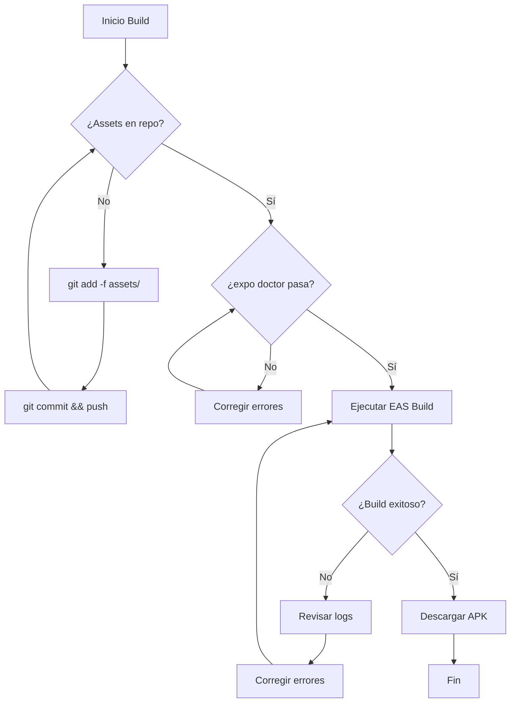

# Plan: Solución Permanente para Generación de APK

## Fecha: 2026-02-24

## Problema

La generación de APK con EAS Build falla recurrentemente debido a problemas que no se han corregido de raíz. Este plan documenta las causas y soluciones permanentes.

---

## Diagnóstico de Causas Raíz

### 1. Assets Fuera del Repositorio

**Síntoma:**
```
Error: cannot access file at './assets/adaptive-icon.png'
```

**Causa Raíz:**
- La carpeta `nexora-mobile/assets/` nunca fue incluida en el repositorio git
- Los archivos existen localmente pero no se trackean en el control de versiones
- EAS Build clona el repositorio desde GitHub, por lo que no tiene acceso a archivos no trackeados

**Evidencia:**
```bash
git ls-tree HEAD assets/
# Retorna vacío - los archivos no están en el repositorio
```

**Solución Permanente:**
- Forzar adición de assets con `git add -f assets/`
- Verificar que NO estén en `.gitignore`
- Confirmar con `git ls-tree` que quedaron trackeados

---

### 2. EAS CLI en Dependencias Locales

**Síntoma:**
```
EAS CLI should not be installed in your project. Instead, install it globally.
```

**Causa Raíz:**
- `eas-cli` está en `package.json` como dependencia del proyecto
- Esto crea conflictos de versiones y warnings que pueden causar fallos

**Solución Permanente:**
- Eliminar `eas-cli` de `package.json`
- Usar siempre `npx eas` para invocarlo
- Documentar en README que EAS CLI se usa vía npx

---

### 3. Falta de Verificación Pre-Build

**Causa Raíz:**
- No existe un proceso automatizado que verifique que el proyecto está listo para build
- Los errores se detectan solo después de 5-10 minutos de build en la nube

**Solución Permanente:**
- Agregar script `prebuild:check` en `package.json`
- Crear archivo `BUILD.md` con checklist manual
- Configurar `expo doctor` para que se ejecute antes del build

---

## Plan de Implementación

### Fase 1: Corrección Inmediata

| Paso | Acción | Comando |
|------|--------|---------|
| 1.1 | Verificar estado de assets | `git ls-tree HEAD nexora-mobile/assets/` |
| 1.2 | Forzar adición de assets | `git add -f nexora-mobile/assets/` |
| 1.3 | Commit y push | `git commit -m "fix: add app assets" && git push` |
| 1.4 | Verificar en GitHub | Confirmar que los archivos aparecen en el repo |

### Fase 2: Limpieza de Dependencias

| Paso | Acción | Archivo |
|------|--------|---------|
| 2.1 | Eliminar eas-cli de package.json | `nexora-mobile/package.json` |
| 2.2 | Actualizar lock file | `npm install` |
| 2.3 | Commit cambios | `git commit -m "chore: remove eas-cli from dependencies"` |

### Fase 3: Documentación y Prevención

| Paso | Acción | Archivo |
|------|--------|---------|
| 3.1 | Crear guía de build | `nexora-mobile/BUILD.md` |
| 3.2 | Agregar script de verificación | `package.json` |
| 3.3 | Actualizar README | `nexora-mobile/README.md` |

---

## Archivos a Crear/Modificar

### Nuevo: `nexora-mobile/BUILD.md`

```markdown
# Guía de Build para Nexora Mobile

## Requisitos Previos

- Node.js 18+
- Cuenta de Expo con EAS configurado
- Acceso al proyecto en GitHub

## Checklist Pre-Build

Antes de ejecutar el build, verifica:

- [ ] Los assets están en el repositorio: `git ls-tree HEAD assets/`
- [ ] No hay cambios sin commit: `git status`
- [ ] El proyecto pasa validación: `npx expo doctor`

## Comandos de Build

### Build de Preview (APK)
```bash
npx eas build --platform android --profile preview
```

### Build de Production (AAB)
```bash
npx eas build --platform android --profile production
```

## Solución de Problemas

### Error: "cannot access file at './assets/...'"
Los assets no están en el repositorio. Ejecuta:
```bash
git add -f assets/
git commit -m "fix: add assets"
git push
```

### Error: "EAS CLI should not be installed in your project"
Ejecuta EAS vía npx:
```bash
npx eas build ...
```
```

### Modificar: `nexora-mobile/package.json`

Agregar en la sección `scripts`:
```json
{
  "scripts": {
    "prebuild:check": "npx expo doctor",
    "build:preview": "npx eas build --platform android --profile preview",
    "build:production": "npx eas build --platform android --profile production"
  }
}
```

Eliminar de `dependencies` o `devDependencies`:
```json
"eas-cli": "..."  // ELIMINAR ESTA LÍNEA
```

---

## Diagrama de Flujo del Build



---

## Verificación Post-Implementación

Después de implementar todas las fases, verificar:

1. **Assets en repositorio:**
   ```bash
   git ls-tree HEAD nexora-mobile/assets/
   # Debe mostrar: adaptive-icon.png, favicon.png, icon.png, splash-icon.png
   ```

2. **EAS CLI no está en package.json:**
   ```bash
   cat nexora-mobile/package.json | grep eas-cli
   # Debe retornar vacío
   ```

3. **Build exitoso:**
   ```bash
   cd nexora-mobile && npx eas build --platform android --profile preview
   # Debe completar sin errores
   ```

---

## Estado: PENDIENTE DE APROBACIÓN

Una vez aprobado este plan, se procederá a implementar en el orden indicado.
