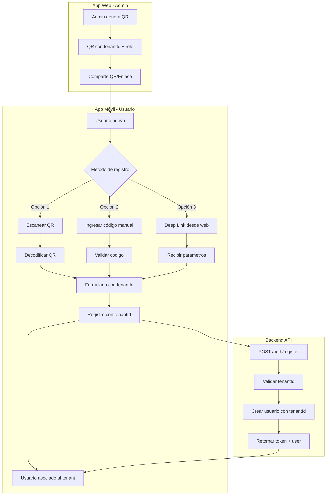
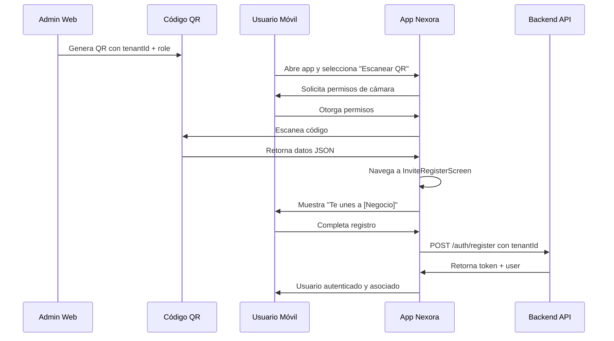
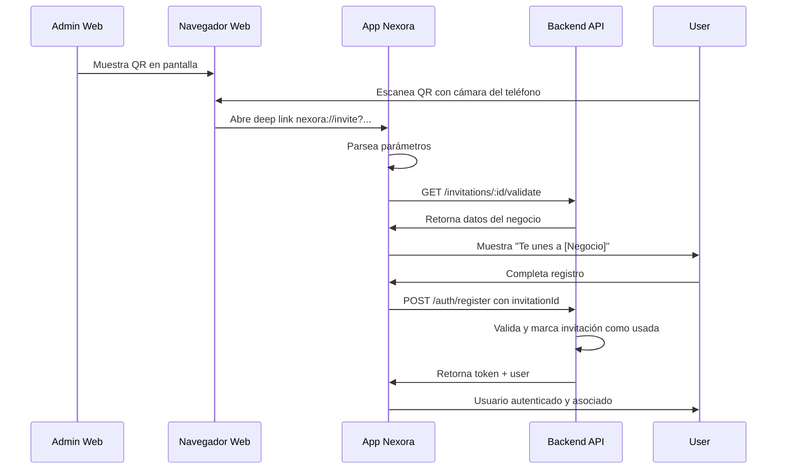

# Arquitectura del Sistema de Invitación con QR

## Resumen Ejecutivo

Este documento describe la arquitectura para implementar un flujo de invitación donde administradores de negocios pueden generar códigos QR para que usuarios finales (clientes o colaboradores) se registren y asocien automáticamente a su tenant.

---

## 1. Análisis del Estado Actual

### 1.1 App Web - Generador de QR Existente

**Archivo**: [`frontend/src/components/InviteManager.tsx`](frontend/src/components/InviteManager.tsx)

**Funcionalidad actual**:
- Genera enlaces con formato: `/?action=register&tenant={tenantId}&role={role}`
- Usa la librería `react-qr-code` para generar QR visual
- Permite seleccionar rol: `client`, `employee`, o `admin`
- Superadmin puede seleccionar cualquier tenant
- Permite copiar enlace y descargar/imprimir QR

**Flujo web actual**:
```
Admin genera QR → Usuario escanea → Abre web con parámetros → Registro web
```

### 1.2 Backend - Registro Actual

**Archivo**: [`backend/src/auth/auth.service.ts`](backend/src/auth/auth.service.ts)

**Registro actual soporta**:
- `tenantId`: ID del tenant (requerido en DTO)
- `role`: Rol del usuario (opcional, default: 'user')
- Roles seguros para auto-asignación: `['user', 'client', 'employee', 'staff']`
- Roles privilegiados (`admin`, `superadmin`) NO se pueden auto-asignar

**DTO de Registro** ([`backend/src/auth/dto/register.dto.ts`](backend/src/auth/dto/register.dto.ts)):
```typescript
{
  firstName: string;
  lastName: string;
  email: string;
  phone?: string;
  password: string;
  tenantId: string;  // Requerido
  role?: string;     // Opcional
}
```

### 1.3 App Móvil - Registro Actual

**Archivo**: [`nexora-mobile/src/screens/auth/RegisterScreen.tsx`](nexora-mobile/src/screens/auth/RegisterScreen.tsx)

**Problema identificado**:
- NO tiene campo para `tenantId`
- NO tiene campo para código de invitación
- NO tiene capacidad de escanear QR
- El `RegisterRequest` en [`auth.api.ts`](nexora-mobile/src/api/auth.api.ts) tiene `tenantId` como opcional pero nunca se envía

**Registro móvil actual**:
```typescript
await register({ email, password, firstName, lastName });
// tenantId nunca se envía
```

---

## 2. Arquitectura Propuesta

### 2.1 Visión General del Flujo



### 2.2 Solución Seleccionada: Escaneo QR + Deep Linking

**Implementación confirmada**:
1. **Escaneo QR**: Usando `expo-camera` / `expo-barcode-scanner`
2. **Deep Linking**: Esquema `nexora://` para abrir la app directamente
3. **Sin códigos manuales**: No se implementará ingreso manual de códigos

**Flujo**:
```
Admin genera QR → Usuario escanea → Deep link abre app → Registro con tenantId
```

**Ventajas**:
- Experiencia fluida para usuarios
- QR funciona tanto en web como móvil
- Menor superficie de ataque (sin brute force de códigos)

---

## 3. Diseño Detallado

### 3.1 Formato del QR/Enlace

**URL Deep Link**:
```
nexora://invite?tenant={tenantId}&role={role}&name={tenantName}
```

**URL Web (fallback)**:
```
https://nexora-app.online/register?tenant={tenantId}&role={role}
```

**Contenido del QR** (formato JSON para flexibilidad):
```json
{
  "type": "nexora-invite",
  "version": 1,
  "tenantId": "restaurante-demo",
  "role": "client",
  "tenantName": "Restaurante Demo",
  "inviteId": "uuid-del-codigo",
  "createdAt": 1700000000
}
```

**Nota**: El `inviteId` permite rastrear y validar el código en el backend.

### 3.2 Cambios en Backend

#### 3.2.1 Nuevo Endpoint: Generar Invitación

```typescript
// POST /invitations/generate
// Solo para admins del tenant

interface GenerateInvitationRequest {
  role: 'client' | 'employee';
}

interface GenerateInvitationResponse {
  id: string;              // UUID de la invitación
  qrData: string;          // JSON para el QR
  deepLink: string;        // "nexora://invite?..."
  webUrl: string;          // URL web fallback
  expiresAt: string;       // ISO date
}
```

#### 3.2.2 Nuevo Endpoint: Validar Invitación

```typescript
// GET /invitations/:id/validate

interface InvitationValidationResponse {
  valid: boolean;
  tenantId: string;
  tenantName: string;
  role: string;
  expiresAt: string;
}
```

#### 3.2.3 Modificar Endpoint de Registro

```typescript
// POST /auth/register
// Ahora requiere invitationId válido

interface RegisterDto {
  firstName: string;
  lastName: string;
  email: string;
  password: string;
  phone?: string;
  invitationId: string;  // REQUERIDO - reemplaza tenantId
}

// El backend:
// 1. Valida que la invitación existe y está activa
// 2. Obtiene tenantId y role de la invitación
// 3. Crea el usuario
// 4. Marca la invitación como usada
```

#### 3.2.3 Entidad: InvitationCode

```typescript
@Entity('invitation_codes')
export class InvitationCode {
  @PrimaryColumn('uuid')
  id: string;           // UUID para el QR
  
  @Column()
  tenantId: string;
  
  @Column()
  role: string;         // 'client' o 'employee'
  
  @Column()
  createdBy: string;    // userId del admin que generó
  
  @Column({ default: 'pending' })
  status: 'pending' | 'used' | 'expired';
  
  @Column({ type: 'timestamp' })
  expiresAt: Date;      // createdAt + 3 días
  
  @Column({ nullable: true })
  usedBy: string;       // userId del usuario que lo usó
  
  @Column({ nullable: true })
  usedAt: Date;
  
  @CreateDateColumn()
  createdAt: Date;
}
```

**Reglas de expiración**:
- `expiresAt = createdAt + 3 días`
- Job diario marca como `expired` los códigos pendientes vencidos
- Al usarse, cambia a `status = 'used'`

### 3.3 Cambios en App Web

#### 3.3.1 Modificar InviteManager.tsx

Cambios necesarios:
1. Generar QR con formato JSON que incluya deep link
2. Mostrar código corto alfanumérico (opcional)
3. Agregar opción de compartir por WhatsApp/Email

**Nuevo formato de QR**:
```typescript
const qrData = JSON.stringify({
  type: 'nexora-invite',
  tenantId: targetTenantId,
  role: selectedRole,
  tenantName: tenantName,
  deepLink: `nexora://invite?tenant=${targetTenantId}&role=${selectedRole}`,
  webUrl: `${baseUrl}/?action=register&tenant=${targetTenantId}&role=${selectedRole}`
});
```

### 3.4 Cambios en App Móvil

#### 3.4.1 Nuevas Dependencias

```json
{
  "expo-camera": "~14.0.0",
  "expo-barcode-scanner": "~13.0.0",
  "expo-linking": "~6.0.0"
}
```

#### 3.4.2 Nueva Pantalla: InviteRegisterScreen

**Ubicación**: `nexora-mobile/src/screens/auth/InviteRegisterScreen.tsx`

**Funcionalidad**:
- Recibir parámetros de deep link o escaneo de QR
- Mostrar información del negocio
- Pre-poblar formulario con tenantId
- Permitir cambiar código manualmente

**Props/Route Params**:
```typescript
interface InviteRegisterParams {
  tenantId?: string;
  role?: string;
  tenantName?: string;
  code?: string;  // Código manual
}
```

#### 3.4.3 Modificar RegisterScreen

Agregar opciones:
1. Botón "Tengo un código de invitación"
2. Botón "Escanear QR"
3. Campo opcional para código manual

#### 3.4.4 Nuevo Componente: QRScannerModal

**Ubicación**: `nexora-mobile/src/components/QRScannerModal.tsx`

**Funcionalidad**:
- Abrir cámara para escanear QR
- Decodificar JSON del QR
- Retornar datos de invitación

#### 3.4.5 Configurar Deep Linking

**Archivo**: `nexora-mobile/app.json`

```json
{
  "expo": {
    "scheme": "nexora",
    "android": {
      "intentFilters": [
        {
          "action": "VIEW",
          "data": [
            {
              "scheme": "nexora",
              "host": "invite"
            }
          ],
          "category": ["BROWSABLE", "DEFAULT"]
        }
      ]
    },
    "ios": {
      "associatedDomains": [
        "applinks:nexora-app.online"
      ]
    }
  }
}
```

**Archivo**: `nexora-mobile/App.tsx` (manejo de deep links)

```typescript
import * as Linking from 'expo-linking';

// En el componente App
useEffect(() => {
  // Manejar deep link inicial
  Linking.getInitialURL().then((url) => {
    if (url) handleDeepLink(url);
  });

  // Escuchar deep links en caliente
  const subscription = Linking.addEventListener('url', ({ url }) => {
    handleDeepLink(url);
  });

  return () => subscription.remove();
}, []);

const handleDeepLink = (url: string) => {
  // nexora://invite?tenant=XYZ&role=client&name=Restaurante
  const { path, queryParams } = Linking.parse(url);
  
  if (path === 'invite' && queryParams.tenant) {
    // Navegar a pantalla de registro con datos
    navigation.navigate('InviteRegister', {
      tenantId: queryParams.tenant,
      role: queryParams.role || 'client',
      tenantName: queryParams.name,
      inviteId: queryParams.id,
    });
  }
};
```

#### 3.4.6 Modificar AuthContext

Actualizar `register` para incluir `tenantId`:

```typescript
const register = async (data: RegisterRequest) => {
  // Si hay tenantId guardado desde invitación, usarlo
  const tenantId = data.tenantId || storedInviteData?.tenantId;
  const role = data.role || storedInviteData?.role;
  
  const response = await authApi.register({
    ...data,
    tenantId,
    role
  });
  // ...
};
```

---

## 4. Flujo de Usuario

### 4.1 Flujo Principal: Escaneo de QR



### 4.2 Flujo Alternativo: Deep Link desde Web



---

## 5. Plan de Implementación

### Fase 1: Backend (Prioridad Alta)

| Tarea | Descripción | Archivos |
|-------|-------------|----------|
| 1.1 | Crear módulo de invitaciones | `backend/src/invitations/` |
| 1.2 | Entidad InvitationCode | `entities/invitation-code.entity.ts` |
| 1.3 | Endpoint generar invitación | `invitations.controller.ts` |
| 1.4 | Endpoint validar invitación | `invitations.controller.ts` |
| 1.5 | Servicio de invitaciones | `invitations.service.ts` |
| 1.6 | Modificar registro para requerir invitación válida | `auth.service.ts` |
| 1.7 | Job/Cron para marcar expirados | `invitations.scheduler.ts` |

### Fase 2: App Web (Prioridad Media)

| Tarea | Descripción | Archivos |
|-------|-------------|----------|
| 2.1 | Modificar formato QR con JSON | `InviteManager.tsx` |
| 2.2 | Integrar con nuevo endpoint de generación | `InviteManager.tsx` |
| 2.3 | Mostrar estado de invitaciones generadas | `InviteManager.tsx` |

### Fase 3: App Móvil (Prioridad Alta)

| Tarea | Descripción | Archivos |
|-------|-------------|----------|
| 3.1 | Instalar expo-camera y expo-linking | `package.json` |
| 3.2 | Configurar deep linking scheme | `app.json` |
| 3.3 | Crear QRScannerModal | `components/QRScannerModal.tsx` |
| 3.4 | Crear InviteRegisterScreen | `screens/auth/InviteRegisterScreen.tsx` |
| 3.5 | Modificar RegisterScreen (agregar botón escanear) | `screens/auth/RegisterScreen.tsx` |
| 3.6 | Actualizar AuthContext | `context/AuthContext.tsx` |
| 3.7 | Actualizar navegación | `navigation/AppNavigator.tsx` |
| 3.8 | API de validación de invitación | `api/invitations.api.ts` |
| 3.9 | Manejar deep links en App.tsx | `App.tsx` |

---

## 6. Consideraciones de Seguridad

### 6.1 Validación de Invitación

- Verificar que la invitación existe y está en estado `pending`
- Verificar que no ha expirado (3 días)
- Verificar que el tenant está activo
- Marcar como `used` inmediatamente después del registro

### 6.2 Expiración Automática

- Job diario que marca códigos expirados
- `expiresAt = createdAt + 3 días`
- Estados: `pending` → `used` o `expired`

### 6.3 Rate Limiting

- Limitar generación de invitaciones por admin (ej: 50/día)
- Limitar validaciones de invitación por IP (ej: 10/minuto)

### 6.4 Roles Seguros

- Solo permitir roles `client` y `employee` via invitación
- Rol `admin` se asigna solo al crear nuevo tenant
- Rol `superadmin` no se puede asignar via invitación

### 6.5 Registro sin Invitación

- **NO permitido**: El backend rechaza registros sin `invitationId` válido
- Error: "Se requiere una invitación válida para registrarse"

---

## 7. Diagrama de Arquitectura

```mermaid
graph TB
    subgraph WebApp[App Web - Admin]
        IM[InviteManager]
        IM -->|POST /invitations/generate| API[Backend API]
        IM -->|muestra| QR[QR Code JSON]
    end
    
    subgraph MobileApp[App Móvil - Usuario]
        RS[RegisterScreen]
        IRS[InviteRegisterScreen]
        QRS[QRScannerModal]
        
        RS -->|botón escanear| QRS
        QRS -->|JSON decodificado| IRS
        DL[Deep Link] -->|nexora://invite| IRS
    end
    
    subgraph Backend[Backend API]
        AUTH[Auth Module]
        INV[Invitations Module]
        TENANT[Tenants Module]
        
        INV -->|valida invitación| TENANT
        AUTH -->|crea usuario con tenantId| TENANT
        AUTH -->|marca usada| INV
    end
    
    subgraph Database[(Database)]
        USERS[Users Table]
        TENANTS[Tenants Table]
        CODES[InvitationCodes Table]
    end
    
    QR -->|escaneado| MobileApp
    IRS -->|POST /auth/register con invitationId| AUTH
    AUTH --> USERS
    INV --> CODES
    TENANT --> TENANTS
```

---

## 8. Decisiones Confirmadas

### 8.1 Método de Invitación
- **Implementar**: Solo escaneo QR con deep linking
- **NO implementar**: Códigos manuales alfanuméricos

### 8.2 Expiración de Códigos
- **Por tiempo**: 3 días después de creado el código
- **Por uso**: Al completar el registro del usuario
- **Estado**: `pending` → `used` o `expired`

### 8.3 Registro sin Invitación
- **NO permitido**: Los usuarios deben tener un código de invitación válido
- **Validación**: Backend rechaza registros sin `tenantId` válido

### 8.4 Dominio de Producción
- **Dominio**: `nexora-app.online`
- **Deep link scheme**: `nexora://`
- **URL web**: `https://nexora-app.online`

---

## 9. Próximos Pasos

Una vez aprobado este diseño:

1. Crear tareas detalladas en el proyecto
2. Implementar Fase 1 (Backend)
3. Implementar Fase 3 (App Móvil) - puede ser en paralelo
4. Implementar Fase 2 (App Web)
5. Testing integral del flujo
6. Documentación para usuarios finales
