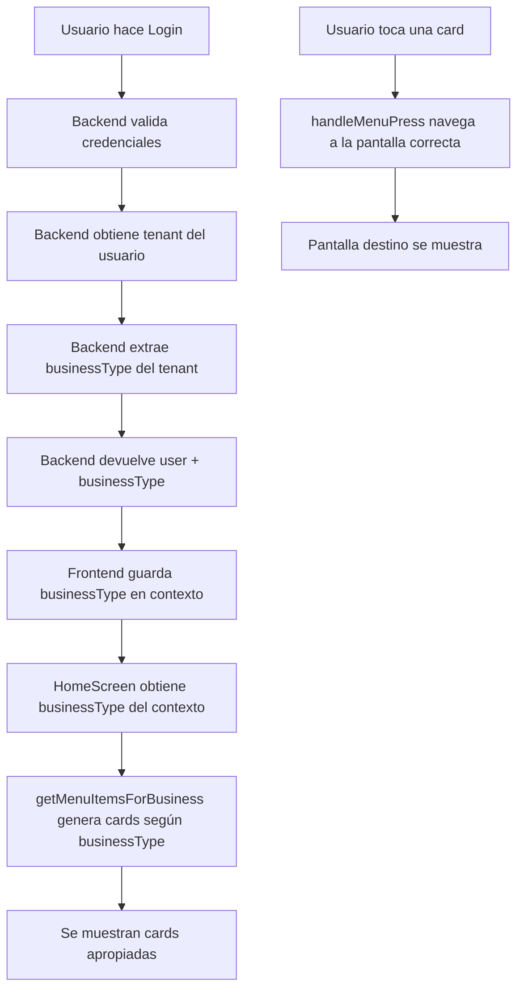

# Plan: Corrección de Cards por Perfil de Usuario y Tipo de Negocio

## Problemas Identificados

### 1. El backend NO devuelve businessType en el login
**Archivo:** [`backend/src/auth/auth.service.ts`](backend/src/auth/auth.service.ts)

El método `login()` devuelve el usuario pero no incluye el `businessType` del tenant:
```typescript
async login(data: LoginDto) {
  const user = await this.validateUser(data.email, data.password);
  const payload = {
    sub: user.id,
    email: user.email,
    tenantId: user.tenantId,
    role: user.role,
  };
  const accessToken = await this.jwtService.signAsync(payload);
  return { accessToken, user }; // user NO tiene businessType
}
```

### 2. Las cards no navegan correctamente
**Archivo:** [`nexora-mobile/src/screens/HomeScreen.tsx`](nexora-mobile/src/screens/HomeScreen.tsx:218)

La navegación está mal implementada:
```typescript
switch (item.route) {
  case 'Products':
    (navigation as any).navigate('Main'); // INCORRECTO - debería navegar a Products
    break;
  case 'Orders':
    (navigation as any).navigate('Main'); // INCORRECTO - debería navegar a Orders
    break;
  // ...
}
```

### 3. Las cards no están organizadas por tipo de negocio
Actualmente se muestran las mismas cards para todos los tipos de negocio sin distinguir:
- Clínicas y Salones de belleza NO deberían tener card de Pedidos
- Restaurantes deberían usar Reservas en lugar de Citas
- Retail no debería tener Citas/Reservas

---

## Tipos de Negocio Definidos

| businessType | Nombre | Pedidos | Citas/Reservas | Etiqueta |
|--------------|--------|---------|----------------|----------|
| `restaurant` | Restaurante | ✅ Sí | ✅ Sí | Reservas |
| `hotel` | Hotel | ❌ No | ✅ Sí | Reservas |
| `clinic` | Clínica | ❌ No | ✅ Sí | Citas |
| `salon` | Salón de Belleza/Spa | ❌ No | ✅ Sí | Citas |
| `gym` | Gimnasio | ❌ No | ✅ Sí | Citas |
| `retail` | Tienda/Retail | ✅ Sí | ❌ No | N/A |
| `services` | Servicios | ❌ No | ✅ Sí | Citas |
| `other` | Otro | ❌ No | ❌ No | N/A |

---

## Solución Propuesta

### Fase 1: Backend - Incluir businessType en el login

**Modificar** [`backend/src/auth/auth.service.ts`](backend/src/auth/auth.service.ts):

1. Inyectar `TenantsService` en `AuthService`
2. En el método `login()`, obtener el tenant y extraer `businessType`
3. Incluir `businessType` en la respuesta del usuario

```typescript
async login(data: LoginDto) {
  const user = await this.validateUser(data.email, data.password);
  
  // Obtener businessType del tenant
  let businessType = null;
  if (user.tenantId && user.tenantId !== 'system') {
    const tenant = await this.tenantsService.findOne(user.tenantId);
    businessType = tenant?.businessType || null;
  }
  
  const payload = {
    sub: user.id,
    email: user.email,
    tenantId: user.tenantId,
    role: user.role,
  };
  const accessToken = await this.jwtService.signAsync(payload);
  
  return { 
    accessToken, 
    user: {
      ...user,
      businessType
    }
  };
}
```

### Fase 2: Frontend - Crear configuración de cards por tipo de negocio

**Crear nuevo archivo** `nexora-mobile/src/config/menuConfig.ts`:

```typescript
export type BusinessType = 'restaurant' | 'hotel' | 'clinic' | 'retail' | 'services' | 'gym' | 'salon' | 'other';

export interface MenuItem {
  icon: string;
  title: string;
  subtitle: string;
  route: string;
  requiredFeature?: 'orders' | 'appointments';
}

// Configuración de features por tipo de negocio
export const BUSINESS_FEATURES: Record<BusinessType, {
  hasOrders: boolean;
  hasAppointments: boolean;
  appointmentLabel: string;
}> = {
  restaurant: { hasOrders: true, hasAppointments: true, appointmentLabel: 'Reservas' },
  hotel: { hasOrders: false, hasAppointments: true, appointmentLabel: 'Reservas' },
  clinic: { hasOrders: false, hasAppointments: true, appointmentLabel: 'Citas' },
  salon: { hasOrders: false, hasAppointments: true, appointmentLabel: 'Citas' },
  gym: { hasOrders: false, hasAppointments: true, appointmentLabel: 'Citas' },
  retail: { hasOrders: true, hasAppointments: false, appointmentLabel: '' },
  services: { hasOrders: false, hasAppointments: true, appointmentLabel: 'Citas' },
  other: { hasOrders: false, hasAppointments: false, appointmentLabel: '' },
};

// Obtener menú según rol y tipo de negocio
export function getMenuItemsForBusiness(
  role: string,
  businessType: BusinessType | null
): MenuItem[] {
  const features = BUSINESS_FEATURES[businessType || 'other'];
  const menuItems: MenuItem[] = [];
  
  // Productos - siempre visible
  menuItems.push({
    icon: '📦',
    title: businessType === 'restaurant' ? 'Menú' : 'Productos',
    subtitle: 'Ver catálogo',
    route: 'Products',
  });
  
  // Pedidos - solo si el negocio tiene pedidos
  if (features.hasOrders) {
    menuItems.push({
      icon: '🛒',
      title: 'Pedidos',
      subtitle: role === 'user' ? 'Mis pedidos' : 'Gestionar pedidos',
      route: 'Orders',
    });
  }
  
  // Citas/Reservas - solo si el negocio tiene citas
  if (features.hasAppointments) {
    menuItems.push({
      icon: '📅',
      title: features.appointmentLabel,
      subtitle: role === 'user' ? `Mis ${features.appointmentLabel.toLowerCase()}` : 'Agenda',
      route: 'Appointments',
    });
  }
  
  // Chat - siempre visible
  menuItems.push({
    icon: '💬',
    title: 'Soporte',
    subtitle: 'Chat con nosotros',
    route: 'ChatList',
  });
  
  // Dashboard - solo para admin/superadmin
  if (role === 'admin' || role === 'superadmin') {
    menuItems.push({
      icon: '📊',
      title: 'Dashboard',
      subtitle: 'Métricas',
      route: 'Dashboard',
    });
  }
  
  return menuItems;
}
```

### Fase 3: Frontend - Corregir navegación de cards

**Modificar** [`nexora-mobile/src/screens/HomeScreen.tsx`](nexora-mobile/src/screens/HomeScreen.tsx):

```typescript
import { getMenuItemsForBusiness, BusinessType } from '../config/menuConfig';

// En el componente:
const menuItems = getMenuItemsForBusiness(
  user?.role || 'user',
  (businessType as BusinessType) || 'other'
);

// Corregir navegación:
const handleMenuPress = (route: string) => {
  switch (route) {
    case 'Products':
      navigation.navigate('Main'); // Main contiene el tab de Productos
      break;
    case 'Orders':
      navigation.navigate('Main'); // Main contiene el tab de Pedidos
      break;
    case 'ChatList':
      navigation.navigate('ChatList');
      break;
    case 'Appointments':
      navigation.navigate('Appointments');
      break;
    case 'Dashboard':
      navigation.navigate('Dashboard');
      break;
  }
};
```

### Fase 4: Frontend - Actualizar AppNavigator

**Modificar** [`nexora-mobile/src/navigation/AppNavigator.tsx`](nexora-mobile/src/navigation/AppNavigator.tsx):

El drawer ya tiene lógica para mostrar/ocultar items, pero necesita usar la misma configuración:

```typescript
import { BUSINESS_FEATURES, BusinessType } from '../config/menuConfig';

// En MainNavigator:
const features = BUSINESS_FEATURES[(businessType as BusinessType) || 'other'];

// Construir screens dinámicamente:
const screens = [
  { name: 'Inicio', component: HomeScreen, ... },
  { name: 'Productos', component: ProductsScreen, ... },
];

// Agregar Pedidos solo si el negocio lo requiere
if (features.hasOrders) {
  screens.push({ name: 'Pedidos', component: OrdersScreen, ... });
}

// Agregar Citas/Reservas solo si el negocio lo requiere
if (features.hasAppointments) {
  screens.push({ 
    name: 'Citas', 
    title: features.appointmentLabel,
    component: AppointmentsScreen, 
    ... 
  });
}
```

---

## Diagrama de Flujo



---

## Archivos a Modificar

| Archivo | Cambio |
|---------|--------|
| `backend/src/auth/auth.service.ts` | Incluir businessType en respuesta login |
| `backend/src/auth/auth.module.ts` | Importar TenantsModule |
| `nexora-mobile/src/config/menuConfig.ts` | **NUEVO** - Configuración de cards por negocio |
| `nexora-mobile/src/screens/HomeScreen.tsx` | Usar menuConfig y corregir navegación |
| `nexora-mobile/src/navigation/AppNavigator.tsx` | Usar menuConfig para drawer dinámico |
| `nexora-mobile/src/context/AuthContext.tsx` | Ya soporta businessType, sin cambios |

---

## Criterios de Aceptación

1. ✅ Al hacer login, el backend devuelve el businessType del tenant
2. ✅ La app muestra cards diferentes según el tipo de negocio:
   - Restaurant: Productos, Pedidos, Reservas, Chat, Dashboard
   - Clinic/Salon: Productos, Citas, Chat, Dashboard (SIN Pedidos)
   - Retail: Productos, Pedidos, Chat, Dashboard (SIN Citas)
   - Other: Productos, Chat, Dashboard
3. ✅ Las cards navegan correctamente a sus pantallas destino
4. ✅ El drawer muestra las mismas opciones que las cards
5. ✅ El label cambia de Citas a Reservas según el tipo de negocio

---

## Problemas Adicionales Encontrados

### 4. DashboardScreen muestra "Citas" sin considerar el tipo de negocio
**Archivo:** [`nexora-mobile/src/screens/admin/DashboardScreen.tsx`](nexora-mobile/src/screens/admin/DashboardScreen.tsx:147)

```typescript
// Línea 147 - Hardcodeado como "Citas"
<Text style={styles.metricLabel}>Citas</Text>
```

**Solución:** Usar `businessType` del contexto para mostrar el label correcto.

### 5. AppointmentsScreen SÍ usa businessType correctamente
**Archivo:** [`nexora-mobile/src/screens/appointments/AppointmentsScreen.tsx`](nexora-mobile/src/screens/appointments/AppointmentsScreen.tsx:22)

Este archivo está bien implementado:
```typescript
const isRestaurant = businessType === 'restaurant';
// Usa isRestaurant para cambiar labels entre "Citas" y "Reservas"
```

### 6. El AuthContext ya soporta businessType pero no lo recibe
**Archivo:** [`nexora-mobile/src/context/AuthContext.tsx`](nexora-mobile/src/context/AuthContext.tsx:66)

El contexto espera recibir `businessType` del backend:
```typescript
if (userData.businessType) {
  setBusinessType(userData.businessType);
}
```

Pero el backend NO lo está enviando en el login.

---

## Archivos Adicionales a Modificar

| Archivo | Cambio |
|---------|--------|
| `nexora-mobile/src/screens/admin/DashboardScreen.tsx` | Usar businessType para label Citas/Reservas |

---

## Resumen de Problemas

| # | Problema | Severidad | Archivo |
|---|----------|-----------|---------|
| 1 | Backend NO devuelve businessType en login | **CRÍTICO** | `backend/src/auth/auth.service.ts` |
| 2 | Cards navegan incorrectamente a 'Main' | **CRÍTICO** | `nexora-mobile/src/screens/HomeScreen.tsx` |
| 3 | Cards no filtradas por tipo de negocio | **CRÍTICO** | `nexora-mobile/src/screens/HomeScreen.tsx` |
| 4 | Drawer no filtrado por tipo de negocio | **ALTO** | `nexora-mobile/src/navigation/AppNavigator.tsx` |
| 5 | Dashboard muestra "Citas" hardcodeado | **MEDIO** | `nexora-mobile/src/screens/admin/DashboardScreen.tsx` |
